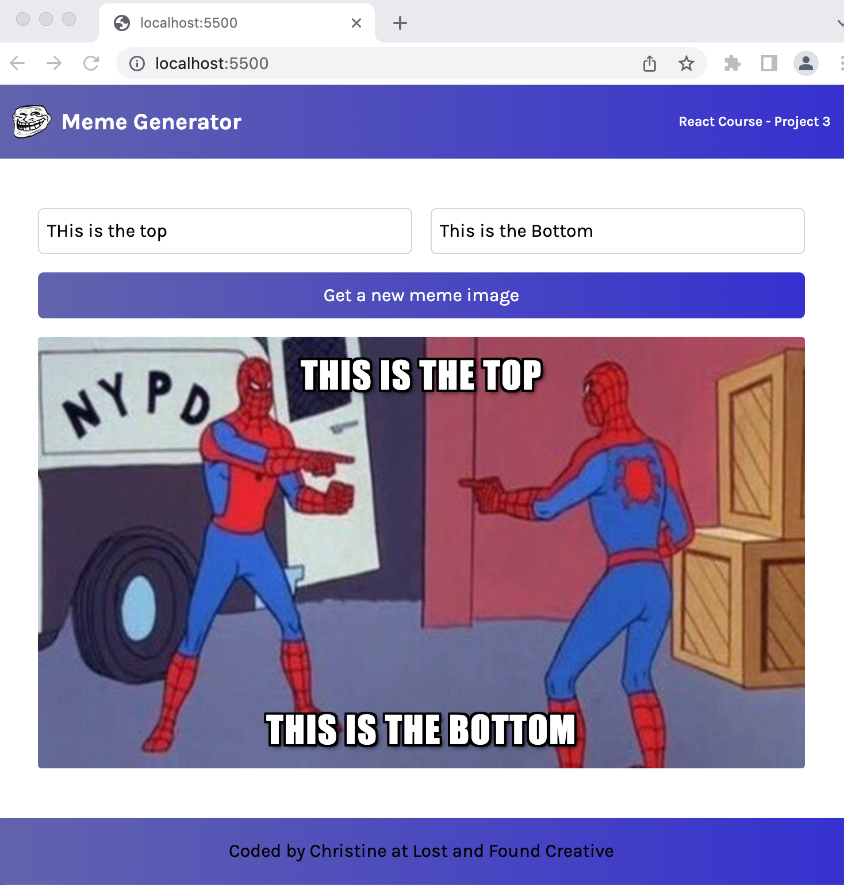

<h2> Scrimba React Project: Meme Generator</h2>



<h3>Built with:</h3>
<ul>
  <li>HTML </li> 
  <li>CSS (Flexbox and CSS Grid)</li>
  <li>React.JS</li> 
</ul>

<h3>What I learned</h3>

<b>React basis like:</b>

<ul>
  <li>Event listeners</li>
  <li>State</li>
  <li>Conditional rendering</li>
  <li>Forms</li>
  <li>Side effects</li>

</ul>

<b>Continued development</b>

<b>I'd like to:</b>

Add an list of previous memes generated and able to recall them.


<b>Quick start:</b>

```
$ yarn # npm install
$ yarn build # npm run build
````

## Development

Run Webpack in watch-mode to continually compile the JavaScript as you work:

```
$ yarn watch # npm run watch
```

Build using Scrimba Tutorial on React.

Happy Coding!
